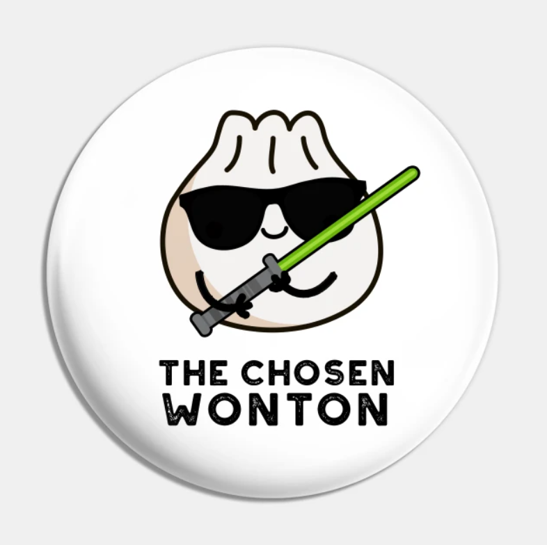

# ***The 110-Wanton-Wontons Team's Page***

## **Meet The Team:**

1. **Victor Kim (*Leader*)**

   - About me: *"My name is Victor. I am a third year Computer Science major. I was chosen as one of the Leaders for this team. Most of my experience comes from working in Javascript for both front-end and back-end. I also have experience in game development, and previously worked with other languages as well."*
   - Way to contact:
     - Info: [Victor Kim](https://wojtektb.github.io/ABOUT-ME/)
     - Email:  *v1kim@ucsd.edu*
     
2. **Elvis Joa (*Leader*)**
   - About me: *"Hi, I'm Elvis. I am a second year Math-Computer Science major, and also the Co-leaders of this team"*
   - Way to contact:
     - Info: [Elvis Joa](https://ejoa27.github.io/CSE110-GitHub-Pages/)
     - Email: *ejoa@ucsd.edu*
3. **Kyle Ng (*Planner*)**
   - About me: *"Hello, I'm Kyle. I am a second year Math-Computer Science major, and also a Planner of this team."*
   - Way to contact:
     - Info: [Kyle Ng](https://kyle589.github.io/CSE110-Lab1/)
     - Email: *kjng@ucsd.edu*
4. **Sean Fuhrman (*Designer*)**
   - About me: *"Hi, I'm Sean. I am a third year Computer Engineering major, and also a Designer of this team."*
   - Way to contact:
     - Info: [Sean Fuhrman](https://sean-fuhrman.github.io/CSE110_Lab1/)
     - Email: *stfuhrma@ucsd.edu*
5. **Kathy Chen (*Developer*)**
   - About me: *"Hi, I’m Kathy! I’m a second year Computer Science major, and also one of the Developers of this team."*
   - Way to contact:
     - Info: [Kathy Chen](https://kathyychenn.github.io/CSE110-Lab1/)
     - Email: *ktchen@ucsd.edu*
6. **Trisha Tong (*Developer*)**
   - About me: *"Hi! I’m Trisha. I’m a second year Computer Science major, and also one of the Developers of this team."*
   - Way to contact:
     - Info: [Trisha Tong](https://trishatong.github.io/cse-110/)
     - Email: *trtong@ucsd.edu*
7. **Kevin Wong (*Developer*)**
   - About me: *"Hello, I'm Kevin. I'm technically a third year Computer Science major, and also one of the Developers of this team."*
   - Way to contact:
     - Info: [Kevin Wong](https://glekko.github.io/My-User-Page/)
     - Email: *kew027@ucsd.edu*
8. **Daniel Lee (*Developer*)**
   - About me: *"Hi, I'm Daniel. I am a second year Computer Science major from Warren, and I like to workout and play video games. I'm a Developer."*
   - Way to contact:
     - Info: [Daniel Lee](https://daniel-lee-user.github.io/)
     - Email: *dhl001@ucsd.edu*  
9.  **Jason Bui (*Developer*)**
    - About me: *"Hello, I'm Jason. I am a second year Computer Science major from Muir, and also one of the Developers of this team."*
    - Way to contact:
       - Info: [Jason Bui](https://jasonb1910.github.io/CSE-110/)
       - Email: *j8bui@ucsd.edu*

<!DOCTYPE html>
<html>

<body>
<iframe width="560" height="315" src="https://www.youtube.com/embed/i5TCFn5VBmk" title="YouTube video player" frameborder="0" allow="accelerometer; autoplay; clipboard-write; encrypted-media; gyroscope; picture-in-picture; web-share" allowfullscreen></iframe>
</body>

</html>

